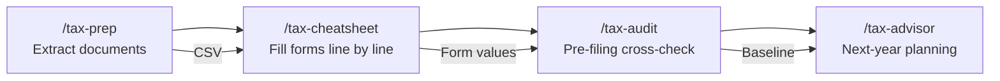

# Tax Filing Skills for Claude Code

> I used Claude Code to build a complete tax-filing copilot — 4 custom skills,
> 8 Python scripts, 13 curated IRS reference files — and filed my real federal
> and state return with it.
>
> This is "vibe coding" applied to something that actually matters.

---

## What This Is

A set of [Claude Code](https://docs.anthropic.com/en/docs/claude-code) skills that turn tax filing from a solo ordeal into a structured conversation. You provide your tax documents. Claude extracts every value, generates line-by-line cheat sheets as you fill each form, audits your completed return for errors before you file, and models what-if scenarios for next year.

Built for **tax year 2025**, covering U.S. federal (Form 1040) and Maryland state (Form 502). The architecture is designed so you can adapt it for any state.

> **Scope:** Federal (Form 1040) + Maryland (Form 502). Optimized for filers with W-2 wages, investment income, small self-employment (Schedule C), mortgage interest, and student loans. Does not currently cover rental income (Schedule E), foreign income, farm income (Schedule F), or complex credits (Child Tax Credit, Education Credits, EIC) — but the architecture is designed to be extended. See [Customizing for Your State](#customizing-for-your-state) and [reference/HOW-TO-CURATE.md](reference/HOW-TO-CURATE.md) for how to add coverage.

**This is not a tax preparation app.** It's a workflow — a set of skills that make Claude Code behave like a methodical, citation-obsessed tax assistant that never does mental math.

## The Pipeline



Each skill reads from and writes to a shared CSV file (`analysis/tax-doc-summary.csv`) — the single source of truth for your entire return.

## Why I Built This

I've been using TurboTax for years — self-prepared filing, no accountant. At some point I realized that TurboTax is mostly just a workflow: it walks you through the forms, looks up the rules, and does the arithmetic. I'm already 80-90% confident I can fill out the forms myself. What I actually need help with is understanding the tax rules for my situation and knowing which values go on which lines.

A lot of people do their own taxes without software — just the forms, the instructions, and a calculator. I figured I'd try it with AI instead of TurboTax.

The key thing that made me comfortable: I can review and audit the final result myself. I know enough to catch mistakes. So this became a good test — build the workflow, use it, then verify the output against what I'd expect.

**Should you use this?** If you have a relatively simple situation and you're confident doing your own taxes, give it a try. If your situation is complicated, or you're not comfortable with DIY filing, hire an accountant. The stakes are high.

## Key Design Decisions

### 1. CSV as Single Source of Truth

`/tax-prep` extracts every box from every document into one CSV. All downstream skills query this CSV — no re-reading documents, no "I think your W-2 said...". One extraction, referenced everywhere.

### 2. Python-Only Math

Every calculation runs through a Python script using `Decimal` arithmetic. The skills never do arithmetic in natural language. When you see a number on a cheat sheet, it came from a script, not from the LLM estimating.

```bash
python .claude/skills/tax-cheatsheet/scripts/standard_vs_itemized.py '{"filing_status": "MFJ", "magi": 120000, ...}'
```

### 3. Citation Discipline

Every tax rule must cite a file in `reference/curated/`. If the rule can't be verified from provided IRS materials, the skill says so explicitly: *"I cannot verify this from provided IRS materials — check IRS.gov."*

No hallucinated tax law. No confident-sounding nonsense.

### 4. Sensitive Field Blanking

Output forms always leave SSN, bank routing, account numbers, and signature fields blank. You fill those in by hand. The AI never handles your most sensitive data.

## Getting Started

### Prerequisites

- [Claude Code](https://docs.anthropic.com/en/docs/claude-code) (the CLI)
- Python 3.10+ (for calculation scripts)
- Your tax documents (W-2s, 1099s, 1098s, etc.)

### Quick Start

1. Clone this repo
2. Open the project in Claude Code
3. Create a `my-tax-docs/` folder and add your tax documents
4. Type `/tax-prep` to extract your document values
5. Use `/tax-cheatsheet` to get line-by-line guidance — use the cheat sheet as a reference while you fill forms in your tax software or on paper
6. Run `/tax-audit` before submitting to catch errors
7. After filing, use `/tax-advisor` to plan for next year

### Customizing for Your State

This project was built for Maryland (Form 502). To adapt for your state:

1. **Replace** `reference/curated/maryland-502-guide.md` with a guide for your state's return
2. **Update** `reference/curated/2025-tax-numbers.md` — replace the Maryland brackets and local tax rates with your state's
3. **Update** `.claude/skills/tax-advisor/scripts/what_if.py` — replace the MD state/local bracket tables with your state's
4. **Modify** `.claude/skills/tax-audit/scripts/cross_check.py` — update the state withholding check (check #7) to match your state's form and line
5. Follow `reference/HOW-TO-CURATE.md` for the curation format

## Skills Reference

| Skill | What It Does | Trigger Phrases |
|-------|-------------|-----------------|
| **`/tax-prep`** | Reads every tax document, extracts box/line values into a structured CSV. Validates for anomalies. | "extract my tax docs", "let's start my taxes", "I have my tax docs ready" |
| **`/tax-cheatsheet`** | Generates line-by-line cheat sheets for any form. Explains what each line means, where the value comes from, which rules apply. | "help me fill out Form 1040", "cheat sheet for Schedule C", "what goes on line 12a" |
| **`/tax-audit`** | Comprehensive pre-filing cross-check. Verifies math, withholding, cross-form consistency, document completeness. Issues a verdict: READY / REVIEW / STOP. | "audit my return", "am I ready to file", "final check" |
| **`/tax-advisor`** | Models what-if scenarios for next year. Quantifies dollar impact of 401(k), HSA, charitable giving, and more on federal + state taxes. | "how to reduce my taxes", "what if I maxed my 401k", "tax planning" |

## Scripts Reference

| Script | Skill | Purpose |
|--------|-------|---------|
| `validate_extraction.py` | /tax-prep | Validate extracted CSV for anomalies (zero withholding, missing cost basis, duplicates) |
| `form_line_lookup.py` | /tax-cheatsheet | Query CSV by document type and box number |
| `standard_vs_itemized.py` | /tax-cheatsheet | Compare standard deduction vs. itemized with SALT cap |
| `schedule_c_calculator.py` | /tax-cheatsheet | Schedule C: COGS, expenses, net profit/loss, SE tax flag, QBI |
| `salt_cap_calculator.py` | /tax-cheatsheet | SALT deduction with $40K cap and MAGI phase-out |
| `cross_check.py` | /tax-audit | 10 cross-checks: income match, AGI math, withholding, brackets |
| `completeness_check.py` | /tax-audit | Document coverage, required forms, orphaned documents |
| `what_if.py` | /tax-advisor | 11 tax-saving scenarios with federal + state + local impact |

All scripts accept a JSON string as a CLI argument and print JSON to stdout. They use Python's `Decimal` type — no floating-point rounding errors on your tax return.

## How the Reference System Works

Tax rules change every year. Rather than hardcode rules into skills, this project uses a **curated reference layer**:

```
IRS publications / state tax booklets (reference/Raw/)
        ↓  Extract rules, thresholds, citations
Curated markdown files (reference/curated/)
        ↓  Skills cite these files
Skills and scripts use rules with citations
```

Each curated file covers one topic (e.g., SALT deduction, mortgage interest, Schedule C). Every rule includes a citation to the source IRS publication, form instruction, or IRC section.

**To update for a new tax year:** Update the 13 curated files with new thresholds. The skills and scripts stay the same. See [HOW-TO-CURATE.md](reference/HOW-TO-CURATE.md) for the format.

### Curated Reference Files

| File | Topic |
|------|-------|
| `1040-line-by-line.md` | Form 1040 line-by-line reference |
| `2025-tax-numbers.md` | Federal/state brackets, deductions, thresholds |
| `additional-medicare-tax.md` | Form 8959 (0.9% Additional Medicare Tax) |
| `investment-income.md` | Schedule B, Schedule D, qualified dividends, capital gains |
| `maryland-502-guide.md` | MD Form 502 line-by-line, subtractions, phase-outs |
| `mortgage-interest.md` | Mortgage interest deduction (Pub 936) |
| `niit-form-8960.md` | Net Investment Income Tax (3.8%) |
| `retirement-hsa-limits.md` | 401(k), IRA, HSA contribution limits |
| `salt-deduction-2025.md` | SALT cap ($40K MFJ), MAGI phase-out |
| `schedule-1a-deductions.md` | OBBBA deductions (tips, overtime, car loan, senior) |
| `schedule-c-guide.md` | Schedule C: business income, COGS, expenses, hobby loss |
| `self-employment-qbi.md` | SE tax, QBI deduction, Form 8995 |
| `student-loan-interest.md` | Student loan interest deduction + phase-out |

## What's Not Included (Privacy)

This repository contains the **workflow and logic** — the reusable part. All personal financial data has been removed.

**Not included:**
- `my-tax-docs/` — Your scanned/PDF tax documents (W-2s, 1099s, etc.)
- `analysis/` — Extracted CSV and generated cheat sheets with real values
- `reference/Raw/` — Source IRS/state PDFs (~40MB, freely available from IRS.gov)
- Situation-specific notes that were in reference files (replaced with placeholder sections)

**The `.gitignore` protects** against accidentally committing personal documents or generated analysis files.

See [docs/PRIVATE-DATA.md](docs/PRIVATE-DATA.md) for details on what these private directories contain and how to set them up.


## Example Outputs

See the [examples/](examples/) directory for sample outputs using fictional data:

- [sample-cheatsheet.md](examples/sample-cheatsheet.md) — Form 1040 line-by-line guidance
- [sample-tax-doc-summary.csv](examples/sample-tax-doc-summary.csv) — Extracted document values
- [sample-audit-report.md](examples/sample-audit-report.md) — Pre-filing audit verdict
- [sample-advisor-report.md](examples/sample-advisor-report.md) — What-if tax planning scenarios

## Future Ideas

- **Multi-state support** — Abstract state-specific logic into a `states/` module pattern
- **Unit tests** — Run each script with sample data to verify outputs
- **Demo mode** — Run the full pipeline end-to-end with fictional data
- **GitHub Actions CI** — Verify scripts stay functional on every push

## Contributing

See [CONTRIBUTING.md](CONTRIBUTING.md) if you'd like to add a skill, fix a bug, or curate a new reference file.

## Disclaimer

These skills assist with tax return preparation. They do not constitute tax advice. Verify all numbers against source documents and IRS publications. Consult a qualified tax professional for your specific situation.

## License

[MIT](LICENSE) — Use it, adapt it, share it.
