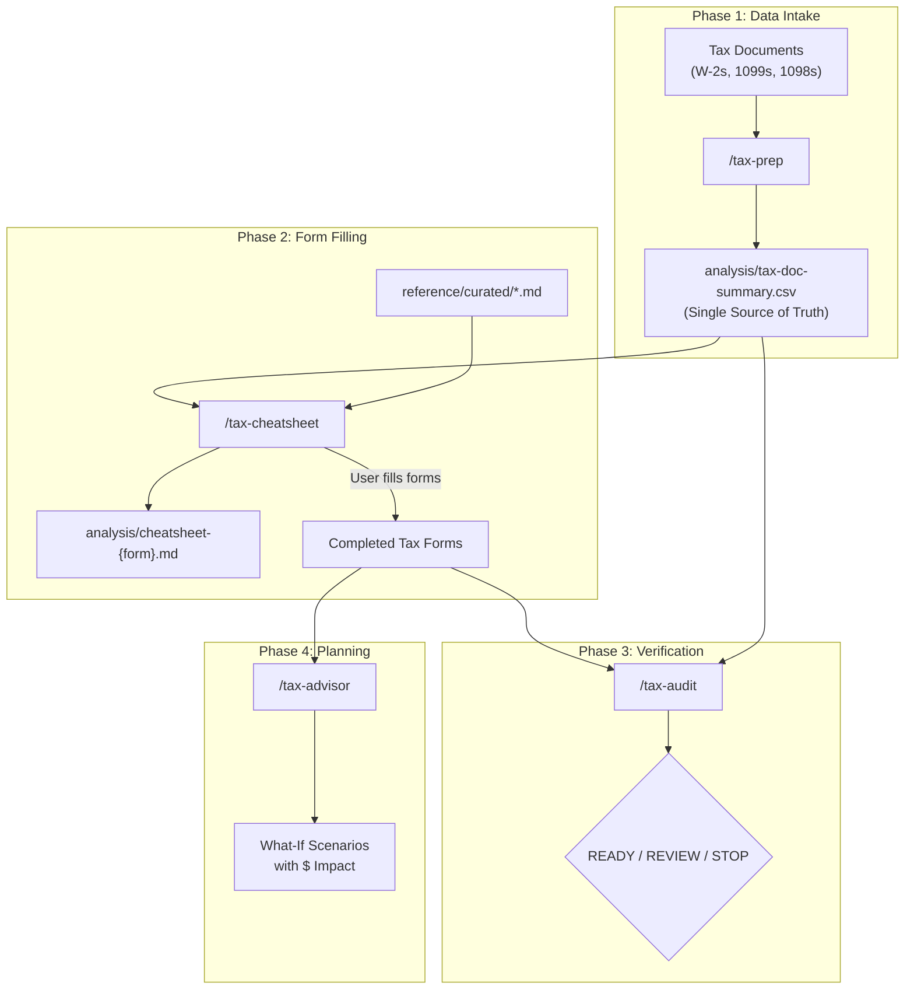

# Architecture

## Pipeline Overview



## Data Flow

```
User provides tax documents (PDFs)
         |
         v
    /tax-prep
    ├── Reads each document
    ├── Extracts box/line values
    ├── Runs validate_extraction.py
    └── Produces analysis/tax-doc-summary.csv
         |
         v
    /tax-cheatsheet
    ├── Queries CSV via form_line_lookup.py
    ├── Runs standard_vs_itemized.py (deduction comparison)
    ├── Runs schedule_c_calculator.py (business income)
    ├── Runs salt_cap_calculator.py (SALT deduction)
    ├── Cites reference/curated/ for every rule
    └── Produces analysis/cheatsheet-{form}.md
         |
         v
    User fills forms using cheat sheets
         |
         v
    /tax-audit
    ├── Collects user's completed form values
    ├── Runs cross_check.py (10 consistency checks)
    ├── Runs completeness_check.py (document coverage)
    ├── Checks 10 known pitfalls (docs/KNOWN-PITFALLS.md)
    └── Issues verdict: READY TO FILE / REVIEW THESE ITEMS / STOP
         |
         v
    /tax-advisor
    ├── Uses baseline from completed return
    ├── Runs what_if.py (11 scenarios)
    └── Reports federal + state + local dollar impact
```

## Script Dependency Map

| Skill | Scripts Called | Purpose |
|-------|--------------|---------|
| `/tax-prep` | `validate_extraction.py` | Validate CSV for anomalies |
| `/tax-cheatsheet` | `form_line_lookup.py` | Query CSV by document/box |
| `/tax-cheatsheet` | `standard_vs_itemized.py` | Deduction comparison |
| `/tax-cheatsheet` | `schedule_c_calculator.py` | Schedule C computation |
| `/tax-cheatsheet` | `salt_cap_calculator.py` | SALT cap with phase-out |
| `/tax-audit` | `cross_check.py` | 10 cross-checks |
| `/tax-audit` | `completeness_check.py` | Document coverage |
| `/tax-advisor` | `what_if.py` | 11 tax-saving scenarios |

## Reference File Dependency Map

| Curated File | Used By |
|-------------|---------|
| `1040-line-by-line.md` | /tax-cheatsheet, /tax-audit |
| `2025-tax-numbers.md` | All skills |
| `additional-medicare-tax.md` | /tax-cheatsheet, /tax-audit |
| `investment-income.md` | /tax-cheatsheet |
| `maryland-502-guide.md` | /tax-cheatsheet, /tax-audit, /tax-advisor |
| `mortgage-interest.md` | /tax-cheatsheet, /tax-audit |
| `niit-form-8960.md` | /tax-cheatsheet |
| `retirement-hsa-limits.md` | /tax-advisor |
| `salt-deduction-2025.md` | /tax-cheatsheet, /tax-audit |
| `schedule-1a-deductions.md` | /tax-cheatsheet, /tax-audit |
| `schedule-c-guide.md` | /tax-cheatsheet, /tax-audit, /tax-advisor |
| `self-employment-qbi.md` | /tax-cheatsheet, /tax-audit, /tax-advisor |
| `student-loan-interest.md` | /tax-cheatsheet, /tax-audit |

## Script Pattern

All scripts follow the same interface:

```python
# Input: single JSON string as CLI argument
python script.py '{"key": "value", ...}'

# Output: JSON object to stdout
{"result": "...", "notes": [...]}

# Arithmetic: Decimal type (no floats)
from decimal import Decimal, ROUND_HALF_UP

def d(val):
    """Convert to Decimal. Returns Decimal('0') for None/non-numeric."""
    ...
```

This pattern ensures:
- **Deterministic results** — Same input always produces same output
- **No floating-point errors** — `Decimal` type prevents rounding issues
- **Composable** — Skills can chain script outputs into other scripts
- **Testable** — Each script can be tested independently with known inputs
